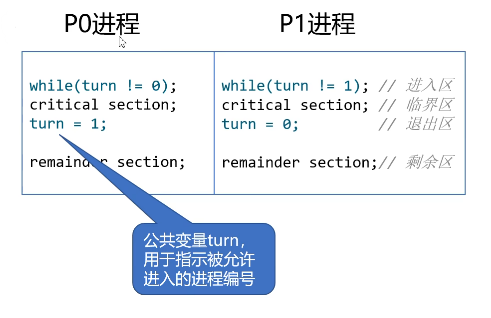
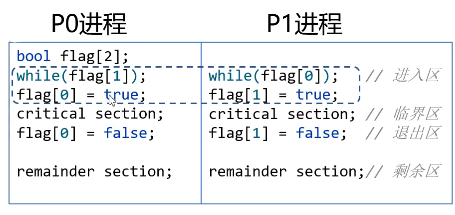
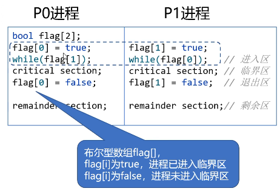
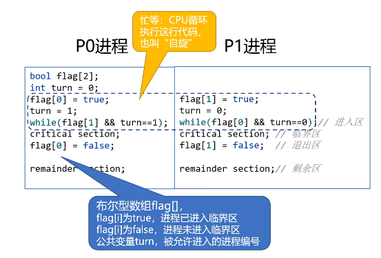
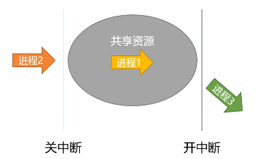
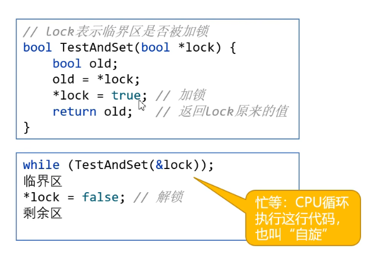
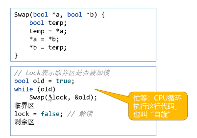
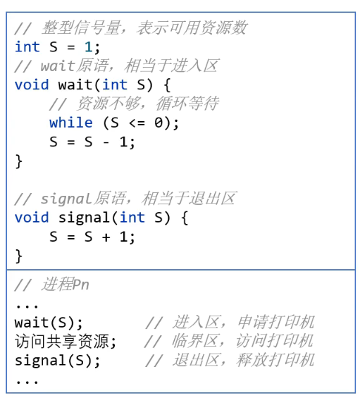
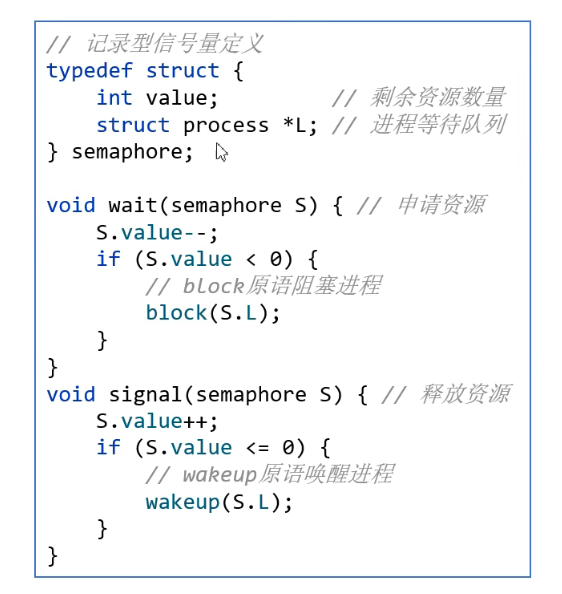
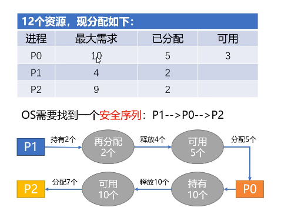

# Process
Process是一个具有一定独立功能的程序关于某个数据集合的一次运行活动，是系统进行`资源分配和调度`的一个独立单位。

+ 进程是程序的一次执行，an instance of a computer program that being executed.
+ 进程是一个程序机器数据在CPU上顺序执行时所发生的活动
+ 进程是程序在一个数据集合上运行的过程
+ 进程是系统进行`资源分配和调度`的一个独立(基本)单位

## Structure
+ 控制块 PCB: Process Control Block, 进程唯一标识
+ 数据段 存放原始数据，中间数据
+ 程序段 存放在文本区域，可被多个进程共享

切换进程/线程时切换的是PCB/TCB
## Feature
+ 动态性：由创建而生，由撤销而亡
+ 并发性：多个进程同时运行
+ 独立性：独立资源分配
+ 异步性：相互独立，互不干扰

## Thread

+ 轻量级进程，是一系列活动按事先设定好的顺序依次执行的过程，是一系列指令的集合
+ 是一条执行路径，不能单独存在，必须包含在进程中
+ 线程是OS中运算调度的最小单位

为什么引入线程？为了提高OS的并发性

### Feature
+ 轻型实体：占用资源更少
+ `独立调度和分派`的基本单位
+ 可并发执行
+ 共享进程资源

## Comparison

Processes:

+ Memory: Separate memory space; more isolated.
+ Overhead: Higher; more costly to create and manage.
+ Communication: Requires Inter-process Communication (IPC); slower.
+ Security: Better isolation; one process can't easily affect another.
+ Use: Run separate applications.

Threads:

+ Memory: Shared memory space within the same process.
+ Overhead: Lower; faster to create, switch and manage.
+ Communication: Direct through shared memory; faster.
+ Security: Less isolated; bugs in one thread can affect others.
+ Use: Perform parallel tasks within the same application.

### Threading Models
+ User Level Thread (User thread to kernel thread: 多对1)
  + 线程控制块在用户空间. The kernel is unaware of these threads, only the process gets noticed.
  + Advantages: 
    + Fast Context Switching: Switching between threads is very fast because it doesn't require a mode switch to the kernel.
    + Low Overhead: Since the kernel doesn’t manage these threads, there’s no need for system calls when creating, destroying, or switching between threads.
  + Disadvantages:
    + Blocking Issues: If one thread performs a blocking operation (like I/O), the entire process is blocked because the kernel is not aware of the individual threads.(不推荐)
    + No True Parallelism: On a multiprocessor system, all user-level threads of a process run on a single processor, as the kernel schedules the entire process as one entity.
+ Kernel Level Thread (User thread to kernel thread: 1对1)
  + 线程控制块在内核空间.数据段和程序段在用户空间. The OS is fully aware of each thread.
  + Advantages:
    + Better Concurrency: Threads can be scheduled on multiple processors, enabling true parallelism on multi-core systems.
    + Independent Blocking: If one thread blocks, other threads in the same process can continue to execute because the kernel manages each thread separately.
  + Disadvantages:
    + Higher Overhead: Managing threads at the kernel level requires more overhead due to system calls and kernel data structures.
    + Slower Context Switching: Context switches are slower compared to ULTs because they require a switch between user mode and kernel mode.
+ Combined or Hybrid Model(User thread to kernel thread: 多对多)
  + Combines aspects of both user-level and kernel-level thread management. Multiple user-level threads are mapped to a smaller number of kernel threads. The kernel is aware of the kernel threads but not necessarily aware of all user-level threads. The user-level threads are managed by a library, but certain threads are mapped to kernel threads for execution.
  + Advantages：
    + Balanced Performance: Offers a balance between the fast context switching of ULTs and the parallelism of KLTs.
    + Flexibility: Can efficiently handle blocking operations without blocking the entire process. If one kernel thread blocks, others can still run user-level threads mapped to different kernel threads.
    + Scalability: The model scales well with the number of processors, as user-level threads can be distributed across multiple kernel threads.
  + Disadvantages:
    + Complex Implementation: The hybrid model is more complex to implement and maintain because it requires coordination between user-level and kernel-level thread management.
    + Overhead: There’s still some overhead involved in managing the mapping between user-level and kernel threads.
  
## How does process work?

3 process status:
1. Ready. 
   + The process has all the resources it needs (like memory, I/O devices) except for the CPU.
   + The operating system keeps this process in a ready queue, waiting for its turn to be executed.
   + The process transitions to the "Running" state when the scheduler selects it and assigns it to a CPU core.
2. Running
   + Only one process (or one thread per core in a multi-core system) can be in the running state at any given time.
   + The CPU executes the instructions of the process, performing computations, accessing memory, etc.
   + The process will remain in this state until it is either preempted by the scheduler (due to time-slicing or higher priority tasks) or voluntarily yields the CPU (e.g., by making an I/O request).
3. Blocked
    + In this state, the process is waiting for some condition to be met, such as data from a disk or a network, or synchronization signals from other processes/threads.
    + While blocked, the process does not consume CPU time, allowing the scheduler to run other processes.
    + Once the awaited event occurs, the process transitions back to the "Ready" state, waiting for CPU availability to resume execution.

```plaintext
   +----------+           +----------+          +----------+
   |          |           |          |          |          |
   |  就绪    |           |  执行    |          |  阻塞    |
   |  (Ready) |           | (Running)|          | (Blocked)|
   |          |           |          |          |          |
   +----------+           +----------+          +----------+
        |                      |                   |
        | 进程调度 (Scheduling) |                   |
        |--------------------->|                   |
        |                      |                   |
        | 时间片完 (Time Slice) |                   |
        |<---------------------|                   |
        |                      |                   |
        |                      |  I/O请求 (I/O Request)
        |                      |------------------>|
        |                      |                   |
        |                      |                   |
        |       I/O完成 (I/O Complete)             |
        |<-----------------------------------------|
```

Also, `new` and `terminated`.

+ new 
  + This is the initial state when a process is first created. 加载PCB，数据段等结构. It hasn't yet been admitted to the "Ready" queue.
  + Transition: Once the process is initialized and ready to run, it transitions from the New state to the Ready state.
+ terminated
  + Definition: This state occurs when a process has finished execution, either by completing its task or being forcefully terminated
  + Transition: Once a process completes its execution, it moves from the Running state (or any other state if it is forcefully killed) to the Terminated state. From this state, the process is removed from memory and its resources are reclaimed by the operating system.

### 进程控制
OS对进程进行有效的管理，包括创建新进程，撤销已有进程，挂起，阻塞和唤醒，进程切换等多种操作。 OS通过原语（Primitive）操作实现进程控制。

原语：由若干条指令组成，完成特定的功能，是一种原子操作。

原语的特点：
+ 原子操作，要么全做，要么全不做
+ 在管态/系统态/内核态下执行，常驻内存
+ 是内核三大支撑功能（中断处理/时钟管理/原语操作）之一

创建原语：create
阻塞原语：block
唤醒原语：wakeup
撤销原语：destory


挂起原语：suspend
+ 静止就绪：放外存，不调度
+ 静止阻塞：等待时间
激活原语：active
+ 活动就绪：等待调度
+ 活动阻塞：等待唤醒


## CPU调度
前提：作业/进程数远远大于处理机数
目的：提高资源利用率。减少CPU空闲时间
调度程序：一方面要满足特定系统用户的需求（快速响应），另一方面要考虑系统整体效率（系统平均周转时间）和调度算法本身的开销

### 调度层次
+ 高级调度/作业调度
  + 把后备作业调入内存
  + 只调入一次，调出一次
+ 中级调度/内存调度
  + 将进程调至外存，条件合适再调入内存
  + 再内，外对换区进行进程对换
+ 低级调度/进程调度
  + 从就绪队列中选取进程分配给CPU
  + 最基本的调度，一个时间片发生一次


### 调度方式
+ 剥夺式/抢占式调度
  + 立即暂停当前进程
  + 分配CPU给另一个进程
  + 原则：优先权/短进程优先/时间片原则
+ 非剥夺式/非抢占式调度
  + 若有进程请求执行
  + 等待直到当前进程完成或阻塞
  + 缺点：适用于批处理系统，不适用分时/实时系统
### 调度过程
1. 保存镜像：记录进程现场信息
2. 调度算法：确定分配CPU的原则
3. 进程切换：分配CPU给其他进程
4. CPU回收：从进程收回CPU

### 调度算法Index
+ CPU利用率 忙碌时间/总时间 越大越好
+ 系统吞吐量 完成作业数/总时间 越大越好
+ 周转时间  作业完成时间-提交时间
  + 带权周转时间：周转时间/实际运行时间
+ 等待时间 作业等待CPU调度时间
  + the total time a process spends in the `ready` queue waiting to be executed by the CPU
  + 关注平均值
+ 响应时间 提交请求到首次响应间隔

### 进程切换细节

0. 检查是否允许上下文切换，有可能某进程处于原指令中，不允许切换
1. 保存当前进程的上下文，包括程序计数器和寄存器
2. 更新PCB信息
3. 把此进程的PCB移入队列，比如就绪队列，或因某种事件停止的阻塞队列
4. 选择另一个（就绪状态）进程执行，并更新其PCB
5. 更新内存管理的数据结构
6. 恢复所选进程的上下文，将CPU执行权交给所选进程

### 常见调度算法

作业调度：
1. First Come First Served
2. Shortest Job First
3. Highest Response Ratio Next
4. Priority-Scheduling Algorithm

进程调度：
1+2+3+4
5. Round-Robin
6. Multileveled Feedback Queue

#### FCFS
+ 内容：调度作业/就绪队列中最先入队者，等待操作完成/阻塞
+ 原则：按作业/进程到达顺序服务
+ 调度方式：非抢占式调度
+ 优点：有利于CPU繁忙型作业，充分利用CPU资源
+ 缺点：不利于I/O繁忙型作业，操作耗时


#### SJF
+ 内容：所需服务时间最短的作业/进程优先服务
+ 原则：追求最少的平均周转时间
+ 调度方式：SJF/SPF非抢占式调度
+ 优点：平均等待/周转时间最少
+ 缺点：
  + 长作业周转时间会增加或饥饿
  + 估计时间不准确，不能保证紧迫任务及时处理


#### HRRN
+ 内容：结合FCFS和SJF，综合考虑等待时间和服务时间计算响应比，高的优先调度
+ 原则：综合考虑等待时间和服务时间，响应比 = （等待+服务）/服务，>= 1
+ 调度方式：非抢占式调度
+ 只有当前进程放弃执行权（完成/阻塞）时，重新计算所有进程响应比
+ 优点：长作业等待越久响应比越高，越容易获得CPU


#### PSA
+ 内容：按照作业/进程的优先级（紧迫程度）进行调度
+ 原则：优先级最高（最紧迫）的作业/进程先调度
+ 调度方式：抢占/非抢占式调度
+ 优先级设置原则
  + 静态/动态优先级
    + 静态是进程创建时就设置好的
    + 动态是进程运行时动态调整的
  + 系统 > 用户； 交互型 > 非交互型；I/O型 > 计算机型
  + 缺点：低优先级进程可能会产生饥饿


#### RR
+ 内容：按照进程到达就绪队列的顺序，轮流分配一个时间片去执行，时间用完则剥夺
+ 原则：公平，轮流为每个进程服务，进程在一定时间内都能得到响应
+ 调度方式：抢占式，由时钟中断确定时间
+ 优点：公平，响应快，适用于`分时`系统
+ 时间片决定因素：系统响应时间，就绪队列进程数量，系统处理能力
+ 缺点：时间片太大相当于FCFS，太小，CPU切换频繁，开销增大

ps: 
+ 实时系统强调任务在严格时间约束下的执行，关键任务必须在规定的时间内完成，常用于对时间敏感的应用。
+ 分时系统则强调资源的公平分配，允许多个任务共享CPU时间，通过快速切换实现多任务并发执行，常用于多用户计算环境。


#### MFQ
+ 内容：设置多个按优先级排序的就绪队列，优先级从高到低，时间片从小到大，新进程采用队列降级法（进入第一级队列，按FCFS分时间片，没有执行完就移到第二级，第三级...）。若前面队列不为空，不执行后续队列进程
+ 原则：PSA + RR
+ 调度方式：抢占式
+ 优点：
  + 对各类型公平，响应快，适用于分时系统
  + 终端型作业用户：短作业优先
  + 批处理作业用户：周转时间短
  + 长批处理作业用户：在前几个队列部分执行


## 进程协作
1. 进程通信
2. 进程同步

### 进程通信
进程通信即进程间的信息交换。
+ 进程是资源分配的基本单位，各进程内存空间彼此独立
+ 一个进程不能随意访问其他进程的地址空间

特点：
1. Shared-Memory
   1. 基于`共享数据结构`的通信方式
    + 多个进程共用某个数据结构（OS提供并控制）
    + 由用户（程序员）负责同步处理
    + 低级通信：可以传递少量数据，效率低
   2. 基于`共享存储区`的通信方式
    + 多个进程共用内存中的一块存储区域
    + 由进程控制数据的形式和方式
    + 高级通信：可以传递大量数据，效率高
2. Message Passing
   1. 直接通信：点到点发送
      + 发送和接受时指明双方进程的ID
      + 每个进程维护一个消息缓冲队列
    
   2. 间接通信：广播信箱
      + 以信箱为媒介，作为中间实体
      + 发进程将消息发送到信箱，收进程从信箱读取
      + 可以广播，容易简历双向通信链
   

3. Pipe
+ 用于连接读/写进程的共享文件，pipe文件
+ 本质是内存中`固定大小`的缓冲区
+ 半双工通信
  + 同一时间只能单向通信，双工通信需要两个管道
  + 以先进先出方式组织数据传输
  + 通过系统调用read()/write()函数进行读写操作


### 进程同步：互斥的访问临界资源
协调进程间的互相制约关系，使它们按照预期的方式执行的过程
前提：
+ 进程是并发执行的，进程间存在着相互制约的关系
+ 并发的进程对系统共享资源进行竞争
+ 进程通信，过程中互相发送的信号成为`消息`或`事件`
两种相互制约形式
+ 间接相互制约关系（互斥）：进程排他性地访问共享资源
+ 直接互相制约关系（同步）：进程间的合作，比如管道通信

访问过程
1. 进入区：尝试进入临界区，成功则加锁（lock）
2. 临界区：访问共享资源
3. 退出：解锁（unlock），唤醒其它阻塞进程
4. 剩余区：其它代码
  

访问原则
+ 空闲让进：临界区空闲，允许一个进程进入
+ 忙则等待：临界区已有进程，其他进程等待（阻塞状态）
+ 有限等待：处于等待的进程，等待时间有限
+ 让权等待：等待时应让出CPU执行权，防止“忙等待”
忙等待：确实一直在执行，但是也是一直在等待，比如死循环，类似于原地踏步

软件实现方法
+ 单标志法：违背“空闲让进”
  P0 P1 可以交替执行
 

 P1得以执行的前提是P0先执行把turn = 1， 但是如果P0只执行一次上述code然后继续执行其他operation，后续P1再想进入critical section就难了，所以届时就算CPU空闲，P1也不能进入critical section

+ 双标志法先检查：违背“忙则等待”
  
  
  但是问题出现在当 flag[0], flag[1] 都为false时，对于P0，while(flag[1]);不执行，与此同时 P1进程while(flag[0]);也不执行,而后P0 进入到flag[0] = true; 后 P1也设置flag[1] = true;导致两个进程同时进入到critical section.

+ 双标志法后检查：违背“空闲让进”，“有限等待”
  

  但是问题出现在当 flag[0], flag[1] 都为false时，对于P0，先设置flag[0] = true，与此同时 P1进程设置flag[1] = true,而后P0 进入while(flag[1]); 后 P1也进入while(flag[1]);导致两个进程死锁，尽管临界区是空闲的但是两个都进不去。

+ `Peterson'Algorithm`：违背“让权等待”，会发生忙等
  

  P0 P1 二者在等待时一直在死循环（while循环）但其实在生产环境中视情况可以接受

硬件实现方式（更常用）
+ 中断屏蔽：关中断/开中断
  + 禁止一切中断，CPU执行完临界区之前不会切换
  + 关中断可能会被滥用
  + 关中断时间长影响效率
  + 不适应于多处理机，无法防止其他CPU调度其它进程访问临界区
  + 只适用于内核进程（该指令运行在内核态）
   
+ TS指令/TSL指令（Test-And-Set/Test-And-Set-Lock）
  + 读出标志并被设置为true,返回旧值，原子操作
  + 违背“让权等待”，会发生忙等
  
+ Swap指令（EXCHANGE, XCHG指令）
  + 交换两个变量的值，原子操作
  + 违背“让权等待”
  

信号量（Semaphore机制）
+ PV操作
  + P：wait原语，进程等待
  + V：signal原语，唤醒等待进程
+ 整型信号量：违背“让权等待”。会发生忙等
 
+ 记录型信号量：程序进入阻塞状态，不会忙等
 + 可将忙等的代码优化为将程序状态变为block
 + 会唤醒所有在此信号量上等待的队列
 

 管程（Monitor, 监视器）
 “管理进程”， 即用于实现进程同步的工具。是由代表共享资源的数据结构和一组过程（进行PV操作的函数）组成的管理程序（封装）。
 + 管程名称
 + 局部于管程内部的共享数据结构
 + 对该数据结构操作的一组过程
 + 管程内共享数据结构的初始化语句

管程的基本特性
+ 是一个模块化的基本程序单位，可以单独编译
+ 是一种抽象数据类型，包含数据和操作
+ 信息掩蔽，共享数据只能被管程内的过程访问


经典同步问题

### 死锁
+ 定义：多个进程由于竞争资源而造成的阻塞现象，若无外力作用，这些进程将无法继续推进
+ 相似概念：饥饿
  + 等待时间过长以至于给进程推进和响应带来明显影响，“饿而不死”
+ 产生原因
  + 系统资源的竞争
  + 进程推进顺序非法
+ 产生的必要条件
  + 互斥条件：共享资源的排他性访问
  + 不剥夺条件：访问时该共享资源不会被剥夺
  + 请求并保持条件：保持当前资源时请求另一个资源
  + 循环等待条件：存在共享资源的循环等待链


如何预防？
+ 破坏互斥条件
  + 将只能互斥访问的资源改为`同时共享`访问
  + 将独占锁改为共享锁
  + `不是所有资源都可改成共享的`

+ 破坏不剥夺/不可抢占条件
  + 请求新资源无法满足时必须释放已有资源
  + 由OS协助强制剥夺某进程持有的资源
  + 实现复杂，代价高
  + 此操作过多导致原进程任务无法推进
+ 破坏请求并保持条件
  + 进程开始运行时一次性申请所需资源
    + 资源浪费
    + 进程饥饿
  + 阶段性请求和释放资源
+ 破坏循环等待条件
  + 对所有资源进行排序，按序号请求资源
    + 请求时先低再高
    + 释放时先高再低
  + 对资源的编号应相对稳定，限制了新设备增加
  + 进程使用资源的顺序可能与系统编号顺序不同
  + 限制了用户编程

如何避免？
安全性算法
+ 系统安全状态
  + 安全状态一定不会出现死锁
  + 不安全状态可能出现死锁
+ 银行家算法
  + 系统预判进程请求是否导致不安全状态
  + 是则拒绝请求，否则答应请求
  

死锁检测与解除
+ 死锁检测
  + 需要一种数据结构，保存有关资源的请求和分配信息
  + 提供一种算法，利用这些信息检测是否形成了死锁
+ 死锁接触
  + 资源剥夺
  + 撤销进程
  + 进程回退