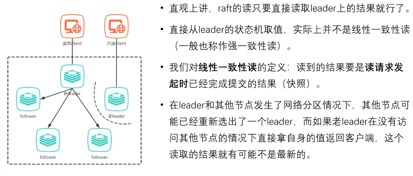

# Three Subproblems
+ Leader election
+ Log replication
+ Safety

# Replicated State Machine
Same Initial state + same input = same End state.

+ The essence of consensus algorithms is to implement state machine replication. 
  + We build distributed storage systems to achieve greater Scalability.
  + To achieve greater storage capacity, we perform Sharding(分片) on the data
  + More machines bring higher Fault rates.
  + To achieve Fault Tolerance, we establish Replication(副本) for each shard.
  + To maintain consistency among replicas, Consensus is introduced.

However, consensus algorithms require significant resources and performance (Low Performance), which in turn affects the system's capacity and the design of sharding.

## Different Situations


# Simplified State

## Follower, Candidate, Leader
  

+ Every node start with the `follower` status. 
  + If it detects there is no leader in the cluster, it will start election and turn itself into `candidate`.
+ If the candidate wins (receives more than half of the votes) in the electon, it will turn itself into `leader` status. Otherwisem it turns into `follower`.
+ If the leader term ends or the leader node corrupts, it will turn to the `follower` 

## Term
 
+ Raft divides time into terms of `arbitrary length`, marked by consecutive integers.
+ Each term begins with an `election`.
  + Sometimes, an election fails to elect a leader, so the term will end without a leader, and a new term will start soon after.
+ In each term, there can be at most one leader.

## RPC
In Raft, servers communicate with each other using `RPC` (Remote Procedure Calls). There are two main types of RPCs in Raft:

+ RequestVote RPC: Initiated by a `candidate` during an election.
+ AppendEntries RPC: Initiated by the `leader`, used to `replicate` logs and provide a `heartbeat` mechanism.
  
+ When servers communicate, they exchange the current term number.
  + If the term number on one server is `smaller` than the others, that server will `update` its term to the larger value.
  + If a candidate or leader discovers that its term number is `outdated`, it will immediately revert to the `follower` state.
  + If a node receives a request with an `outdated` term number, it will directly `reject` the request.

# Leader Election
When an election process begins, the follower 
+ first `increments` its current `term` number and switches to the `candidate` state. 
+ It then votes for `itself` and concurrently sends vote requests (`RequestVote` RPC) to other server nodes in the cluster.

## Heartbeat Mechanism
+ If there is a leader, it will `periodically` send heartbeats to all followers to maintain its position. 
+ If a follower does not receive a heartbeat for a while, it will assume that there is no available leader in the system and will then start an election process.

## Three Results
There will be 3 results for a candidate.
1. **It (the candidate) wins the election** by receiving more than half of the votes -> Becomes the leader and starts sending heartbeats.
2. **Another node wins the election** -> Upon receiving heartbeats from the new leader, if the new leader's term number is `not less than` its current term number, the candidate reverts to the follower status.
3. **No candidate wins after a certain period** -> Each candidate increases it term number and `starts a new round` of voting after a random election timeout.

Why might there be no winner? 

For example, if multiple followers become candidates at the same time, the votes may be too `scattered`, and `no` candidate receives `more than half` of the votes.

The random election timeout suggested in the paper is 150~300ms.

## RequestVote RPC

```C++
// RequestVote RPC Request
type RequestVoteRequest struct {
    term         int  // Current term number
    candidateId  int  // Candidate's ID
    lastLogIndex int  // Index of the candidate's last log entry
    lastLogTerm  int  // Term of the candidate's last log entry
}

// RequestVote RPC Response
type RequestVoteResponse struct {
    term         int   // Current term number
    voteGranted  bool  // Whether or not this candidate is granted the vote
}

```

+ For a follower that has not become a candidate, it will cast its vote on a `first-come, first-served` basis for the same term.

+ Why does the RequestVote RPC need to include information about the candidate's last log entry? This will be explained further in the context of `safety` concerns.

# Log replication
After the leader is elected, it begins serving client requests.

How does the client know which node is the new leader?
If the client sends a request randomly to a node, there are 3 cases.
1. the node is leader
2. the node is a follower. It can get the leader id from the heartbeat and inform the client
3. the node doesn't work(no response). Client will go find another node.

When the leader receives a command from the client, it will append the command as a new entry to the log.

A log entry must contain three pieces of information:
+ State machine command
+ Leader's term number
+ Log index (log entry index)

A log can only be decided by both term number and log index.

The leader concurrently sends the `AppendEntries RPC` to the followers, instructing them to replicate the entry. Once the entry has been replicated by `over half` of the followers, the leader can execute the command locally and return the result to the client.

We call the local execution of the command, which is the step where the leader applies the log entry to its state machine, a "`commit`".


During this process, `there is a possibility that the leader or followers may crash or become slow`. Raft must ensure that it continues to support log replication in an orderly manner under these circumstances and that the log entries on each replica remain consistent (to ensure the state machine is consistent). There are three possible scenarios:

① If a follower does not respond to the leader for some reason, the leader will `repeatedly resend` the additional entry requests (AppendEntries RPC) even if the leader has already returned the result to the client.

② If a follower crashes and then recovers, Raft’s `consistency check` for additional entries will ensure that the follower can recover in order and fill in any missing logs after the crash.

Raft's consistency check: When the leader sends an additional entry RPC to the follower, it includes the index position and term number of the previous log entry. If the follower does` not find this previous entry` in its log, it will `reject` the entry. Upon receiving the follower's rejection, the leader will send the follower the `previous log entry`, `gradually moving` towards identifying and filling in the follower's first missing log.

-------------------------------------------------------------------

If desired, the protocol can be optimized to reduce the number of rejected AppendEntries RPCs.

For example, when rejecting an AppendEntries RPC request, the follower can include the term number of the conflicting log entry and the index of the first entry with that term from its own log.

Using this information, the leader can skip all conflicting log entries in that term and decrease nextIndex; this way, the term for each conflicting log entry requires only one AppendEntries RPC instead of one for each entry.

In practice, this optimization is generally `not necessary` because failures do not occur frequently, and there are unlikely to be many conflicting log entries.

-------------------------------------------------------------------

③ `If the leader crashes`, the crashed leader may have already replicated some log entries to the followers but has not committed them (i.e., has not finalized them), and the newly elected leader may not have these log entries. This can lead to discrepancies where some followers have logs that differ from the new leader's logs.

In this situation, Raft resolves the inconsistency by `forcing` the followers to `overwrite` their logs with the `new leader’s logs`, meaning that any log entries on the followers that conflict with the leader’s logs will be overwritten by the new leader's log entries (because there was no commit, external consistency is not violated).

Through this mechanism, the leader does not need to perform any special operations to restore logs to a consistent state after recovery.

The leader only needs to perform normal operations, and the logs will automatically become consistent when the follower recovers and fails the AppendEntries consistency check.

`The leader will never overwrite or delete its own log entries. (Append-Only)`

This log replication mechanism ensures consistency:

+ As long as a majority of servers are functioning correctly, Raft can receive, replicate, and apply new log entries;
+ Under normal circumstances, new log entries can be replicated to a majority of the cluster with a single RPC;
+ A slow follower will not impact the overall consistency.

```C++
// Append Entries RPC Request
type AppendEntriesRequest struct {
    term int            // Current term number
    leaderId int        // Leader's ID (this is the sender's ID)
    prevLogIndex int    // Index of the previous log entry
    prevLogTerm int     // Term of the previous log entry
    entries []byte      // Log entries to store (empty for heartbeat; may send more than one for efficiency)
    leaderCommit int    // Leader's commit index
}

// Append Entries RPC Response
type AppendEntriesResponse struct {
    term int           // Current term number
    success bool       // True if follower contained entry matching `prevLogIndex` and `prevLogTerm`
}

```
1. Log Consistency Check: The follower will only recognize the log as consistent if both prevLogIndex and prevLogTerm match the follower's corresponding entries. This ensures that the log structure remains consistent across nodes.

2. Follower Commit Behavior: Followers cannot commit log entries immediately upon receiving them from the leader because they lack knowledge of whether the log entry has been replicated by the majority of nodes.

3. Leader's Role in Commit: The leader commits a log entry only after confirming it has been replicated by the majority of nodes. The leader then informs its followers about the committed log through the leaderCommit field in the AppendEntries RPC request. Upon receiving this information, followers can mark the previously uncommitted log entries as committed and apply them to their state machines.

4. Commit Index Update: If leaderCommit > commitIndex, the follower updates its commitIndex to the smaller value between leaderCommit and the index of the last new entry. This ensures that all logs can be committed once the leader’s commit index surpasses the follower's commit index.

5. Success Condition in AppendEntries Response: The success flag in the AppendEntries RPC response is set to true only if the request’s term is greater than the follower's term and the request passes the consistency check (i.e., the log entry matches the follower’s current state).

# 安全性
领导者选举和日志复制还不能完全保证每一个状态机会按照相同的顺序执行相同的命令，所以raft通过几个补充规则完善整个算法，使其在各类宕机问题下都不出错。

这些规则包括：
1. Leader宕机处理：选举限制
2. Leader宕机处理：新leader是否提交之前任期内的日志条目
3. Follower和Candidate宕机处理
4. 时间与可用性限制

## Leader宕机处理：选举限制

如果一个follower落后了leader若干条日志（但没有漏整个任期），那么在下次选举中，按照现有的选举规则，它依旧有可能当选为leader。它在当选新leader后就永远无法补上之前缺失的那部分日志，从而造成状态机之间的不一致。

所以需要对领导者选举增加一个限制，保证被选出来的leader一定包含了之前各任期的所有被提交的日志条目。

RequestVote RPC 执行了这样的限制：`RPC中包含了candidate的日志信息，如果投票者自己的日志比candidate的还新，它会拒绝投票请求`。

Raft 通过比较两份日志中最后一条日志条目的索引值和任期号来定义谁的日志更新。

+ 如果候选人的 lastLogTerm 与投票者的 lastLogTerm 相同，那么 lastLogIndex 较大的候选人日志更长，表示其日志更“新”。
+ 如果候选人的 lastLogTerm 比投票者的任期号更大，表示候选人的日志更新，不论其 lastLogIndex。

```C++
// 请求投票RPC Request
type RequestVoteRequest struct {
    term           int  // 自己当前的任期号
    candidateId    int  // 自己的ID
    lastLogIndex   int  // 自己最后一个日志条目的索引
    lastLogTerm    int  // 自己最后一个日志的任期
}
```

## Leader宕机处理：新leader是否提交之前任期内的日志条目
日志提交条件：一旦当前任期内的某个日志条目已经存储到超过半数的服务器节点上，leader 就知道该日志条目可以被提交了。

follower 的提交触发：通过下一个 AppendEntries RPC（心跳或新日志）来触发。

单点提交 vs. 集群提交：在Raft协议中，日志条目的提交是通过集群中多数节点的一致同意来决定的。Leader可以根据Append Entries RPC Response的success来判断是否达到集群提交条件。

+ 如果某个leader在提交某个日志条目之前崩溃了，以后的leader会试图完成该日志条目的`复制`。
  + 复制，而非提交，不能通过心跳提交老日志。
+ `Raft永远不会通过计算副本数目的方式来提交之前任期内的日志条目`。

在下面例子中，S5覆盖掉了已提交的日志2，是危险的。


+ 只有leader当前任期内的日志条目才通过计算副本数目的方式来提交；
  + 因为可以确认自己当前的任期号是最大的
+ 一旦当前任期的某个日志条目以这种方式被提交，那么由于日志匹配特性，之前的所有日志条目也都会被间接地提交。
在下面的例子(c)中，新Leader S1靠新产生一个日志4间接地提交了日志2，是安全的


## Follower和Candidate宕机处理

Follower和Candidate崩溃后的处理方式比leader崩溃要简单的多，并且两者的处理方式是相同的。
+ 如果follower或candidate崩溃了，那么后续发送给他们的RequestVote和AppendEntries RPCs都会失败。
+ Raft通过无限的重试来处理这种失败。如果崩溃的机器重启了，那么这些RPC就会成功地完成。
+ 如果一个服务器在完成了一个RPC，但是还没有response的时候崩溃了，那么它重启之后就会再次收到同样的请求。(Raft的RPC都是幂等的)
  
## 时间与可用性限制
+ Raft算法整体不依赖客观时间，也就是说，哪怕因为网络或其他因素，造成后发的RPC先到，也不会影响Raft的正确性。（这点和Spanner不同）
+ 只要整个系统满足下面的时间要求，Raft就可以选举出并维持一个稳定的leader：
  + 广播时间 (broadcastTime) << 选举超时时间 (electionTimeout) << 平均故障时间 (MTBF)
+ 广播时间和平均故障时间是由系统决定的，但是选举超时时间是我们自己选择的。Raft的RPC需要接受并将信息落盘，所以广播时间大约是0.5ms到20ms，取决于存储的技术。因此，选举超时时间可能需要在10ms到500ms之间。大多数服务器的平均故障间隔时间都在几个月甚至更长。

# 集群成员变更
+ 在需要改变集群配置的时候（如增减节点、替换宕机的机器或者改变复制的程度），Raft可以进行配置变更自动化。
+ 自动化配置变更机制最大的难点是保证转换过程中不会出现同一任期的两个leader，因为转换期间整个集群可能划分为两个独立的大多数。
脑裂(brain spilt)问题：
+ 下图为三节点（S123）集群扩容到五节点（S12345）
  + S1S2为老配置集群，S3S4S5为新配置集群
  + 老配置为三节点，S1S2可以选出一个leader（2/3）
  + 新配置为无节点，S3S4S5可以选出一个leader（3/5）


## 如何解决脑裂问题？
所以配置采用了一种两阶段的方法。

+ 集群先切换到一个过渡的配置，称之为联合一致（`joint consensus`）。
+ 第一步骤，leader发起C_old,new，使整个集群进入联合一致状态。这时，所有RPC都要在新旧两个配置`集群`中都达到大多数才算成功。
+ 第二步骤，leader发起C_new，使整个集群进入新配置状态。这时，所有RPC只要在新配置下能达到大多数就算成功。
```C++
type AppendEntriesRequest struct {
    term int            // Current term number
    leaderId int        // Leader's ID (this is the sender's ID)
    prevLogIndex int    // Index of the previous log entry
    prevLogTerm int     // Term of the previous log entry
    entries []byte      // Log entries to store (empty for heartbeat; may send more than one for efficiency)
    leaderCommit int    // Leader's commit index
}
```

一旦某个服务器将该新配置日志条目增加到自己的日志中，他就会用该配置来做出未来所有的决策（服务器总是使用它日志中最新的配置，无论该配置日志是否已经被提交）。

这意味着Leader不用等到Cold,new和Cnew返回，就会直接使用其中的新规则来作出决策。

我们假设leader可以在集群成员变更更何时起宕机，大概有以下几种可能：

1. leader在Cold,new未提交时宕机

2. leader在Cold,new已提交但Cnew未发起时宕机

3. leader在Cnew已发起时宕机
  

可以把新配置和老配置替换成新集群和老集群，更方便理解。


缩减节点的情况：


如果新节点在日志还没同步的情况下参与了联合一致状态或者成为了新配置的一部分，它可能会因为缺少某些日志条目而导致日志提交失败。这种情况下，集群的正常运作会受到影响，因为日志复制和一致性协议要求所有参与节点的日志是一致的。


## 单节点集群变更
比上述联合一致，在现在场景中更常用。
每次只增减一个节点，相比于多节点变更，最大的差异是`在新的集群配置和旧的集群配置中，大多数成员是重合的`


### Leader宕机情况讨论


### 缺陷


什么是网络分区？

网络分区是指在分布式系统中，组成集群的服务器因为网络故障被分隔成了多个无法互相通信的子集。比如，假设你的系统有 5 个服务器节点（A, B, C, D, E），它们分布在两个不同的机房里。如果这两个机房之间的网络连接断开了，A 和 B 在一个子集里，C, D 和 E 在另一个子集里，它们彼此之间无法通信，这就是网络分区。

为什么网络分区会导致无法选出 leader？

在一致性协议中（如 Raft），选出新的 leader 通常需要大多数节点（即多数派或 quorum）同意。如果系统被分区了，不同子集中的节点无法互相通信，那么在每个子集里可能都没有足够的节点数量来形成多数派。

举个例子：

如果一个系统需要有至少 3 个节点同意才能选出 leader，而网络分区后每个子集只有 2 个节点，那么无论在任何一个子集内，都无法达到 3 个节点的要求。结果就是，无法在任何一个子集里选出新的 leader，导致整个系统无法继续正常工作。

结果是什么？

由于不能选出 leader，系统可能会陷入停止状态，无法处理新的请求。这种情况被称为脑裂（split-brain），即系统被分割成了两个或多个部分，每部分都无法正常运作，或者可能会出现多个 leader 导致数据不一致的情况。

已提交的Cnew2被Cnew1覆盖


## 日志压缩


## 只读操作处理



## Summary


+ 拜占庭情况：有节点不但会发送错误命令，还可能会“使坏”，如存储不可靠，消息错误等
+ 非拜占庭情况：网络延迟，丢包，重复发送，乱序等问题
+ 5个机器可以容忍2个宕机，4个机器可以容忍1个宕机


